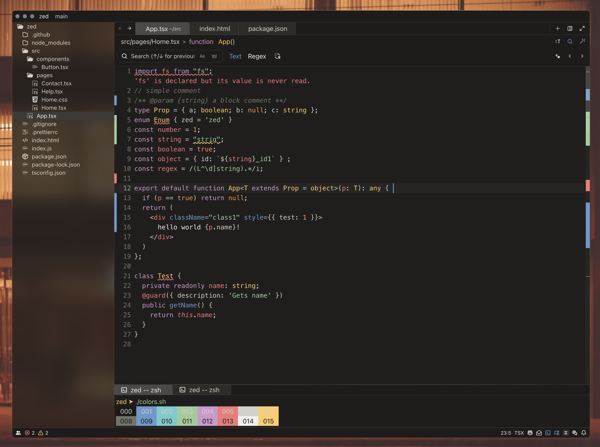

```
================================================================================
    __    _             _     __   ____  _       __    __  _
   / /   (_)___ ___  __(_)___/ /  / __/ (_)___ _/ /_  / /_(_)__  _____
  / /   / / __ `/ / / / / __  /  / /_  / / __ `/ __ \/ __/ / _ \/ ___/
 / /___/ / /_/ / /_/ / / /_/ /  / __/ / / /_/ / / / / /_/ /  __(__  )
/_____/_/\__, /\__,_/_/\__,_/  /____//_/\__, /_/ /_/\__/_/\___/____/
           /_/                         /____/

                    A Zed Editor Color Theme
                         Version 1.0.0
================================================================================
```

A warm, translucent dark theme combining macOS Tahoe's Liquid Glass aesthetic with the classic Base16 Eighties palette.

**Author:** Zeph Leggett
**License:** MIT

---

## Description

Liquid Eighties is a dark color theme for the Zed text editor featuring:

- Blurred transparency effects (Liquid Glass aesthetic)
- Safari-style chrome and tab styling
- Warm, retro-inspired UI tones
- Base16 Eighties syntax highlighting palette
- Full terminal color support
- Optimized contrast ratios for extended coding sessions

This theme was engineered for developers who appreciate the warm color temperature of vintage CRT displays combined with modern translucency effects.

---

## Screenshot



See more at [zed-themes.com](https://zed-themes.com/themes/IgdISgFhi-laoQsOHG_Ns)

---

## Installation

### Method A: Zed Themes Website (Recommended)

1. Visit: https://zed-themes.com/themes/IgdISgFhi-laoQsOHG_Ns
2. Click "Install" button
3. Theme will be added to your Zed installation
4. Select "Liquid Eighties" from theme picker (`Cmd+K, Cmd+T`)

### Method B: Manual Installation

1. Locate your Zed themes directory:
   ```
   macOS:  ~/.config/zed/themes/
   Linux:  ~/.config/zed/themes/
   ```

2. Copy `liquid-eighties.json` to the themes directory:
   ```sh
   cp liquid-eighties.json ~/.config/zed/themes/
   ```

3. Restart Zed or reload configuration

4. Open Command Palette (`Cmd+Shift+P`) and select "theme selector: toggle"

5. Choose "Liquid Eighties" from the list

---

## Color Palette

### Syntax Colors (Base16 Eighties)

| Color | Element | Hex |
|:---:|---|---|
|  | Background | `#1f1e1c` |
|  | Foreground | `#d3d0c8` |
|  | Comments | `#747369` |
|  | Red (tags/vars) | `#f2777a` |
|  | Orange (constants) | `#f99157` |
|  | Yellow (types) | `#ffcc66` |
|  | Green (strings) | `#99cc99` |
|  | Cyan | `#66cccc` |
|  | Blue (functions) | `#6699cc` |
|  | Magenta (keywords) | `#cc99cc` |

### UI Colors

| Color | Element | Hex |
|:---:|---|---|
|  | Title Bar | `#1d1c1a` |
|  | Active Tab | `#4a4946` |
|  | Inactive Tab | `#2d2c29` |
|  | Editor Background | `#1f1e1c` |
| | Panel Background | transparent |
|  | Selection | `#6699cc40` |
|  | Accent | `#6699cc` |

---

## Known Issues

- Blur effects only work on macOS with compositor enabled
- Some icon themes may not harmonize with warm color palette
- Transparency may reduce readability on very light desktop backgrounds

Report issues at: https://github.com/zephleggett/zed-liquid-eighties/issues

---

## Credits

| | |
|---|---|
| Base16 Eighties | Chris Kempson (original palette) |
| Liquid Glass | Apple Inc. (design language) |

Special thanks to the Zed team for making an excellent editor.
